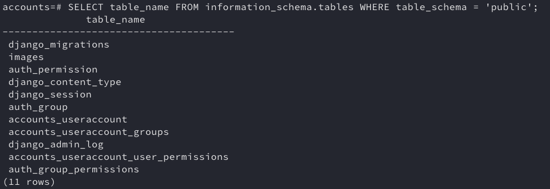
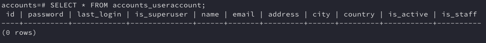
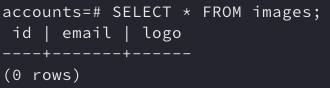
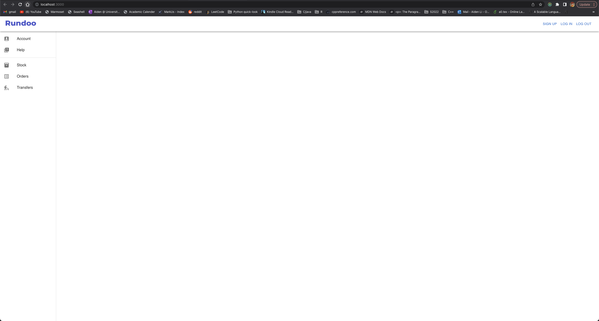

# Rundoo Take-Home Project
The web app currently supports user log-in authentication, user sign up, user log out, upload logos, and display uploaded logos.

The code part for SMTP mail verification during user sign-up has been set but disabled for testing purpose.
API endpoints are publicly accessible for testing purpose. 
Uploaded images are stored locally in the /media folder for testing purpose.

## Tech Stack

- Frontend: React, Typescript, Redux, Material UI
- Backend: Django, Django Rest Framework, Djoser (for user auth system), Postgres

## Installation

```bash
pip install requirements.txt
npm install
```

## Start

```bash
psql postgres postgres
create database accounts owned by postgres
\c accounts
SELECT table_name FROM information_schema.tables WHERE table_schema = 'public';
SELECT * FROM accounts_useraccount;
SELECT * FROM images;
```





```bash
cd Rundoo/backend/supplier_sys/
python manage.py runserver

cd Rundoo/frontend/
npm start
```




## Features our database supports:

- User Log In (With Verification)
- User Log Out
- User Sign Up
  - NOTICE: Please don't register with trivial password. I haven't created the warning message, so you'll have to go to the console to realize this BAD REQUEST issue.
- Upload Logo Image
  - NOTICE: The first time uploading images might take a while. Try logging out and logging in again.
- Show All Uploaded Logos

